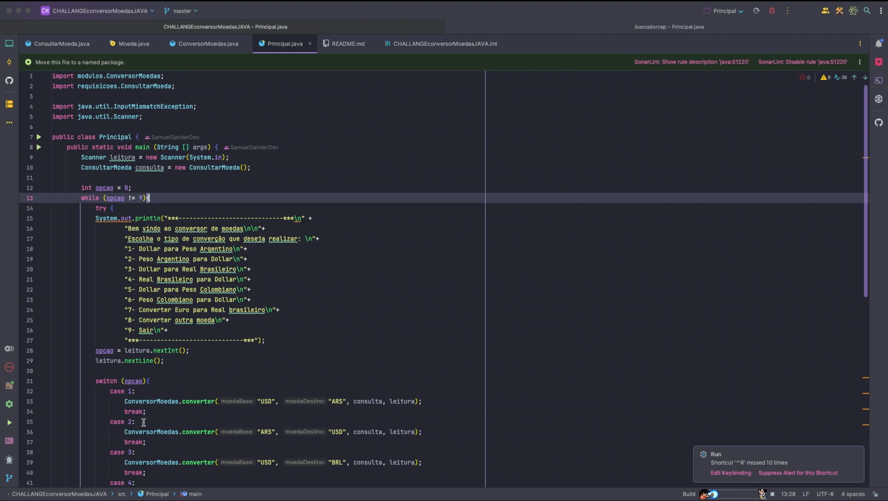

# 🌍  Conversor de Moedas

Bem-vindo ao **Conversor de Moedas**! Este projeto foi desenvolvido em **Java** e utiliza a **ExchangeRate-API** para converter diferentes moedas com base em taxas de câmbio reais.

## 🚀 Funcionalidades

- 🔄 **Conversão entre moedas pré-definidas** como Dólar, Peso Argentino, Real Brasileiro e Peso Colombiano.
- 🌎 **Conversão personalizada** para qualquer outra moeda disponível na API.
- 👨‍💻 **Interface interativa via terminal**, fácil de usar.

## 🛠️ Estrutura do Projeto

A aplicação está dividida nos seguintes pacotes e classes:

### `Principal.java`

Este é o ponto de entrada do programa. O usuário é guiado por um menu interativo para escolher as conversões que deseja realizar.

- 📋 **Menu de Opções**: O programa oferece diferentes opções de conversão, como Dólar para Peso Argentino, Peso Colombiano para Dólar, entre outras.
- 🔄 **Laço while**: Um loop mantém o programa em execução até que o usuário escolha a opção de sair.
- 💡 **Switch Case**: O código utiliza um bloco `switch` para executar a conversão desejada com base na escolha do usuário.

### `ConversorMoedas.java`

Esta classe é responsável pela lógica de conversão das moedas.

- 💰 **Função `converter`**: Realiza a conversão de uma moeda base para uma moeda destino.
    - Usa a taxa de câmbio atual para calcular o valor convertido.
    - Exibe a taxa de câmbio e o resultado da conversão no console.
- 🌍 **Função `converteOutraMoeda`**: Permite ao usuário inserir manualmente as moedas de origem e destino para realizar conversões personalizadas.

### `ConsultarMoeda.java`

Aqui está a lógica de requisição da taxa de câmbio.

- 🌐 **Requisição HTTP**: Utiliza a classe `HttpClient` do Java para fazer uma requisição à API e obter a taxa de conversão entre as moedas escolhidas.
- 📊 **Resposta JSON**: Os dados retornados pela API são manipulados utilizando a biblioteca `Gson` para deserialização do JSON.

### `Moeda.java`

Esta classe define o modelo de dados para a resposta da API.

- 🔑 **Atributos**:
    - `base_code`: código da moeda de origem.
    - `code_target`: código da moeda de destino.
    - `conversion_rate`: taxa de conversão entre as moedas.

## 📋 Exemplo de Execução

Aqui está um exemplo de como o programa se comporta ao ser executado:

```bash
***-----------------------------***
Bem vindo ao conversor de moedas

Escolha o tipo de conversão que deseja realizar:
1- Dólar para Peso Argentino
2- Peso Argentino para Dólar
3- Dólar para Real Brasileiro
4- Real Brasileiro para Dólar
5- Dólar para Peso Colombiano
6- Peso Colombiano para Dólar
7- Converter Euro para Real brasileiro
8- Converter outra moeda
9- Sair
          
***-----------------------------***
```
## 📹 Exemplo de Execução em Vídeo


Este vídeo mostra o programa em ação, guiando o usuário pelas diferentes opções de conversão e exibindo os resultados com base nas taxas de câmbio atuais.

## Exemplo de Execução

[](https://youtu.be/3bOgmsx6xCs)


Após selecionar uma das opções, o programa solicita o valor que você deseja converter e retorna o valor convertido utilizando a taxa de câmbio atual.

## 🎯 Tecnologias Utilizadas

- **Java 17**: Linguagem de programação.
- **ExchangeRate-API**: API para obter as taxas de conversão de moedas.
- **Gson**: Biblioteca para manipulação de JSON.

## ✨ Experiência de Desenvolvimento

Este projeto foi uma experiência incrível! 🎉 Fiquei muito feliz em poder aplicar todo o conhecimento que venho adquirindo em **Java** e desenvolvimento backend. O processo de integração com uma API externa e a manipulação de dados em tempo real foi desafiador e muito gratificante.

## 📝 Como Executar

1. Clone o repositório:

    ```bash
    git clone https://github.com/SamuelSanderdev/CHALLANGE-conversorMoedasJAVA.git
    ```

2. Importe o projeto em sua IDE favorita.
3. Certifique-se de que todas as dependências estão instaladas, como `Gson`.
4. Execute o arquivo `Principal.java` para iniciar a aplicação.

## 📚 Futuras Melhorias

- Adicionar uma interface gráfica para melhorar a experiência do usuário.
- Expandir o número de moedas pré-definidas no menu principal.

Espero que essa documentação esteja clara e facilite o uso e a compreensão do projeto! 🚀💻
